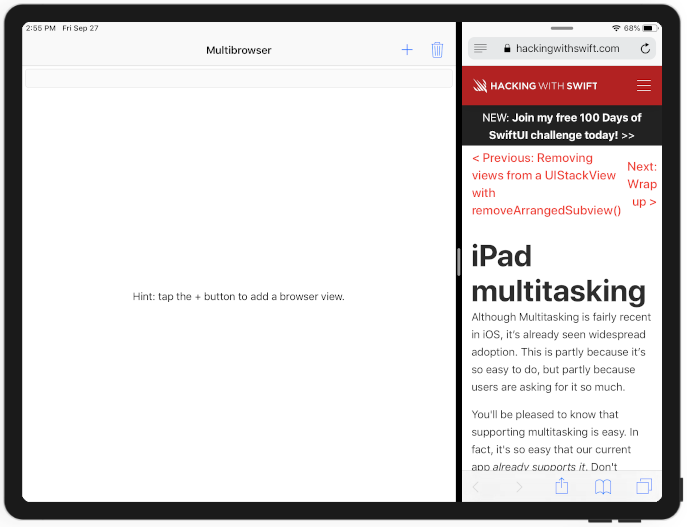
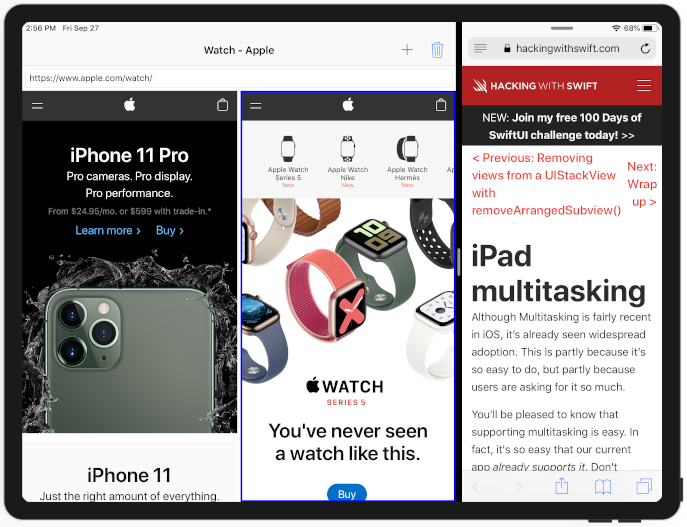

# Project 31

https://www.hackingwithswift.com/read/31/

Includes solutions to the [challenges](https://www.hackingwithswift.com/read/31/6/wrap-up).

## Topics

UIStackView, iPad multitasking

## Challenges

From [Hacking with Swift](https://www.hackingwithswift.com/read/31/6/wrap-up):
>1. If you want to try extending this project, the sensible place to start is in the URL entry: if users don't type "http://" before their web site addresses the app fails, which isn't very helpful.
>2. Another smart place to improve the app is inside the setDefaultTitle() method: it just writes Multibrowser in the navigation bar while leaving a large white space in the center – hardly intuitive, and it wouldn't be hard to add a placeholder label in there telling users what to do.

## Screenshots

