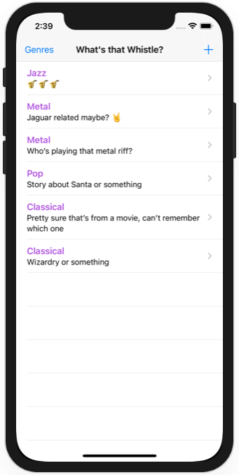
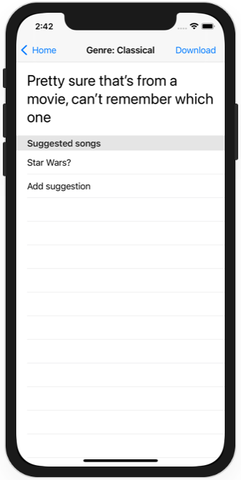
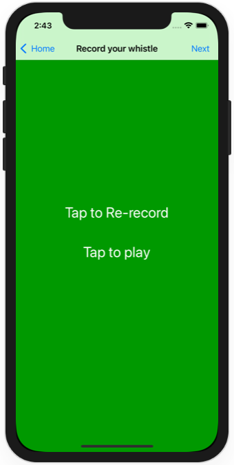
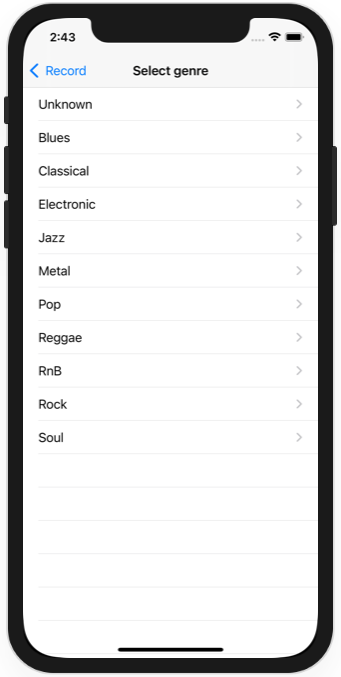
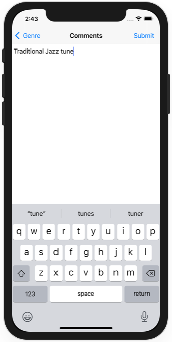

# Project 33 - What's that Whistle?

https://www.hackingwithswift.com/read/33/

Includes solutions to the [challenges](https://www.hackingwithswift.com/read/33/9/wrap-up).

## Topics

CloudKit, AVAudioRecorder

## Challenges

From [Hacking with Swift](https://www.hackingwithswift.com/read/33/9/wrap-up):
>1. If the iCloud fetch fails, we tell the user. How about adding a "Retry" button to the user interface?
>2. We made the Whistle class inherit from NSObject. Can you make it conform to the NSCoding protocol? You might find project 12’s guide to NSCoding and UserDefaults in Swift useful.
>3. Fix the AddCommentsViewController class so that it correctly adjusts the text view when the keyboard appears. I already showed you how to do this in project 16.
>4. Stop people from posting too many line breaks in their comments, or at least trim the comments when shown in the main table view.
>5. Of course, the other thing you could do is perhaps the most important of all: go back through all your code and make sure you handle CloudKit errors gracefully.

## Screenshots

