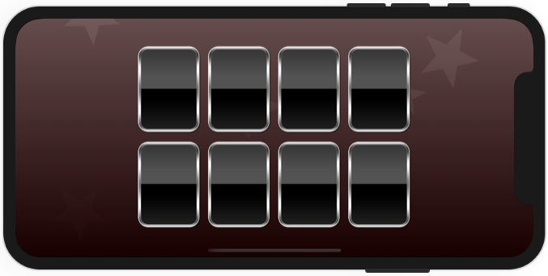
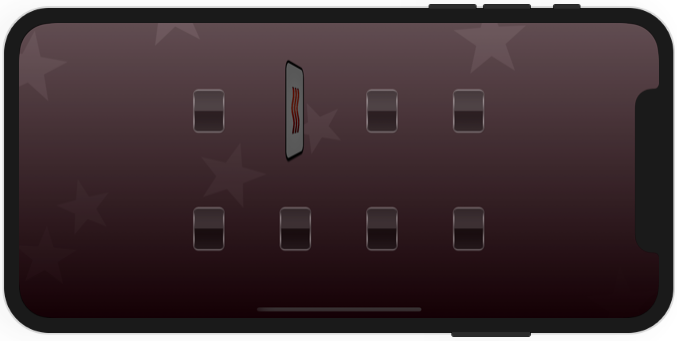

# Project 37 - Psychic Tester

https://www.hackingwithswift.com/read/37/

## Credits

- Phantom from Space by [Kevin MacLeod](http://incompetech.com/music/royalty-free/index.html?isrc=USUAN1500038) is licensed under CC Attribution 3.0.
- Coin Drop 1 sound by [shandonsound](https://freesound.org/s/267412/) under Creative Commons 0 License.

## Topics

WatchOS, WCSession, CAGradientLayer, CAEmitterLayer, card flip effects, 3D Touch

## Challenges

From [Hacking with Swift](https://www.hackingwithswift.com/read/37/10/wrap-up):
>1. f you want to try taking the app further, try implementing the sessionWatchStateDidChange() method in ViewController.swift to detect when the Watch goes to sleep – if you make your phone play a brief but innocuous sound, it would alert you to wake your watch.
>2. If you're looking for something more advanced, try adding a hidden button to the Watch user interface that enables "always win mode" – i.e., every card that gets tapped will be the star. Your patter can then be, "I promise it's not a trick, in fact I can even transfer my psychic power to you!" and watch as your friend suddenly finds the star every time.

## Screenshots

