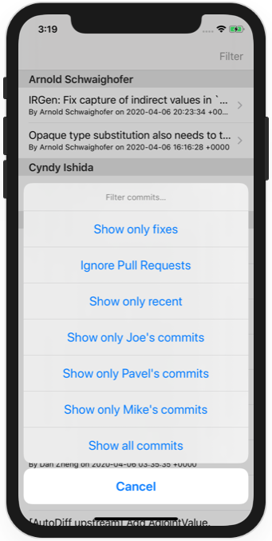
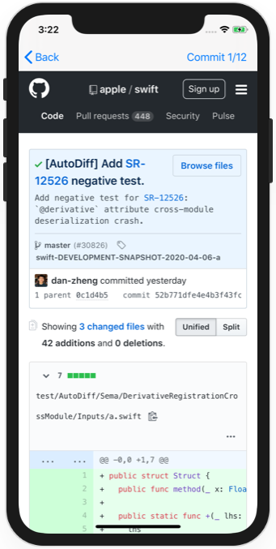
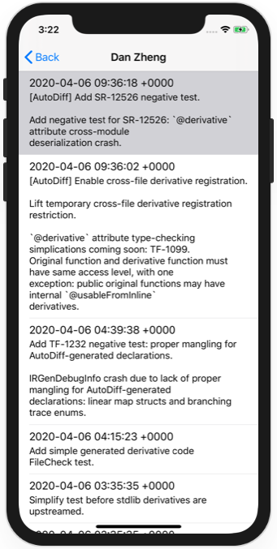

# Project 38 - GitHub Commits

https://www.hackingwithswift.com/read/38/

## Topics

Core Data, NSFetchRequest, NSManagedObject, NSPredicate, NSSortDescriptor, and NSFetchedResultsController

## Challenges

From [Hacking with Swift](https://www.hackingwithswift.com/read/38/11/wrap-up):
>1. Fun: Try creating a new Xcode project using the Master-Detail Application template, but enable the Core Data checkbox. You should be able to read through most of the code and understand how it works.
>2. Tricky: Use the "url" attribute of Commit in the detail view controller to show the GitHub page in a WKWebView rather than just a label.
>3. Taxing: Rewrite the getNewestCommitDate() method so that it uses UserDefaults rather than a fetch request in order to fix the bug in the current implementation. (Didn't spot the bug? If users delete the most recent commit message, we also lose our most recent date!)
>4. Mayhem: Complete the showAuthorCommits() method in the detail view controller. This should show a new table view controller listing other commits by the same author. To make your life easier, you might want to try going to the Author entity, choosing its "commits" relationship, then checking the "Ordered" box and recreating the NSManagedObject subclass. Don't forget to remove the optionality from the properties that get generated!
>5. For extra credit: what happens when you delete the last row from a particular section? See if you can experiment with using deleteSections() rather than deleteRows() to fix that!

## Screenshots

