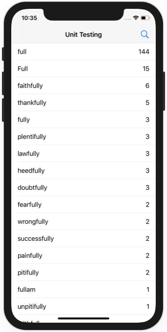
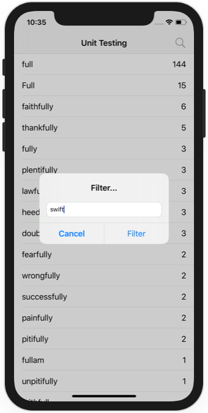

# Project 39 - Unit testing with XCTest

https://www.hackingwithswift.com/read/39/

## Topics

XCTest, measure(), filter(), sort(), NSCountedSet

## Challenges

From [Hacking with Swift](https://www.hackingwithswift.com/read/39/9/wrap-up):
>1. Can you write a test that verifies there are 55 table rows when the user filters by words that appear 1000 or more times?
>2. Can you write a test that ensures something sensible happens if the cancel button is pressed?
>3. Can you write a performance test to ensure applyUserFilter() doesn't get any slower?
>4. There's also a bug in the code that you ought to be able to fix easily: if the user enters nothing into the filter text box, applyUserFilter() gets called with an empty string as its parameter and no results will be shown. It's down to you to think up a better solution: is it better to pretend Cancel was tapped instead? Or perhaps consider an empty string to mean "show all words"? 

## Screenshots

