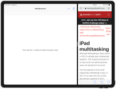
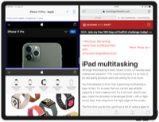
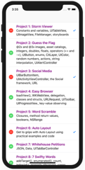
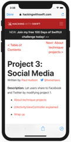
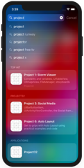
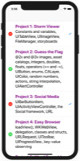
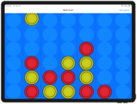
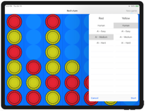

# Hacking with Swift

Solutions to Paul Hudson's "Hacking with Swift" projects and challenges.

https://www.hackingwithswift.com/read

## Note
First 30 projects are available in the separate repository [100 days of Swift](https://github.com/clarknt/100-days-of-swift).

## Completion status

Type               | Number   | Completion
:---               |  :---:   |   :---:
Projects           | 33 / 39  | 85%
Challenges         | 98 / 116 | 84%

## Preview

*Within each project are larger versions of the screenshots.*

Projects / Topics                                                                                                                                                            | Screenshots
---                                                                                                                                                                          |---
[Project 31](01-Project31) (with challenges)                                           UIStackView, iPad multitasking                                |    |
[Project 32](02-Project32) (with challenges)                                           Core Spotlight, SFSafariViewController, NSAttributedString, Automatically sized table view cells, Dynamic Type  |     |
[Project 34](04-Project34) (with challenges)                                           GameplayKit, AI, heuristic, UIStackView  |   |
