# Hacking with Swift

Solutions to Paul Hudson's "Hacking with Swift" projects and challenges.

https://www.hackingwithswift.com/read

## Note
First 30 projects are available in the separate repository [100 days of Swift](https://github.com/clarknt/100-days-of-swift).

## Completion status

Type               | Number   | Completion
:---               |  :---:   |   :---:
Projects           | 38 / 39  | 97%
Challenges         | 113 / 116 | 97%

## Preview

*Within each project are larger versions of the screenshots.*

Projects / Topics                                                                                                                                                            | Screenshots
---                                                                                                                                                                          |---
[Project 31](01-Project31) - *Multibrowser*  (with challenges)                                           UIStackView, iPad multitasking                                |    |
[Project 32](02-Project32) - *SwiftSearcher*  (with challenges)                                           Core Spotlight, SFSafariViewController, NSAttributedString, Automatically sized table view cells, Dynamic Type  |     |
[Project 34](04-Project34) - *Four in a Row*  (with challenges)                                           GameplayKit, AI, heuristic, UIStackView  |   |
[Project 35](05-Project35) - *Generating Random Numbers*                                           Traditional and GameplayKit random numbers generation  | No screenshot
[Project 36](06-Project36) - *Crashy Plane*  (with challenges)                                          SpriteKit, collisions, parallax scrolling, SKAudioNode  | 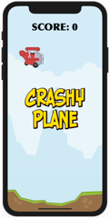 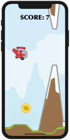 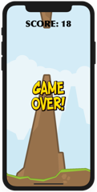 
[Project 37](07-Project37) - *Psychic Tester*  (with challenges)                                          WatchOS, WCSession, CAGradientLayer, CAEmitterLayer, card flip effects, 3D Touch  | 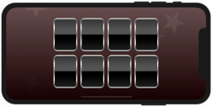 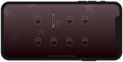  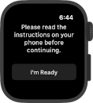 
[Project 38](08-Project38) - *GitHub Commits*  (with challenges)                                          Core Data, NSFetchRequest, NSManagedObject, NSPredicate, NSSortDescriptor, and NSFetchedResultsController  | 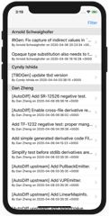 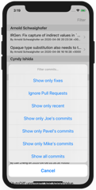 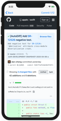 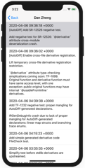 
[Project 39](09-Project39) - *Unit testing with XCTest*  (with challenges)                                          XCTest, measure(), filter(), sort(), NSCountedSet  | 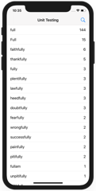 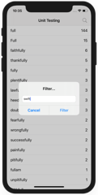 

